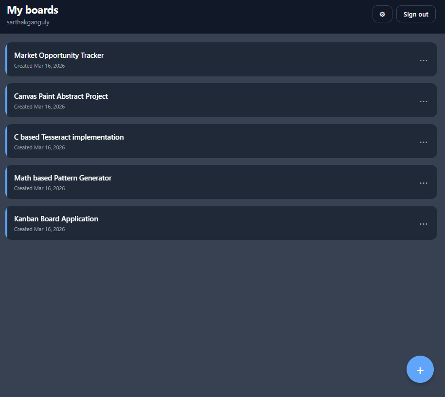
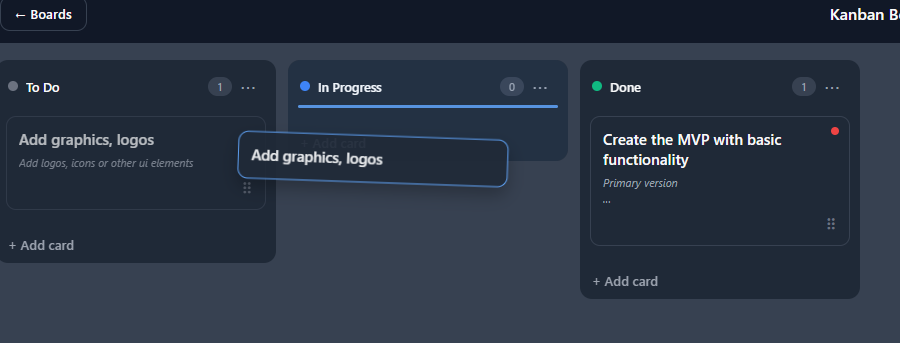
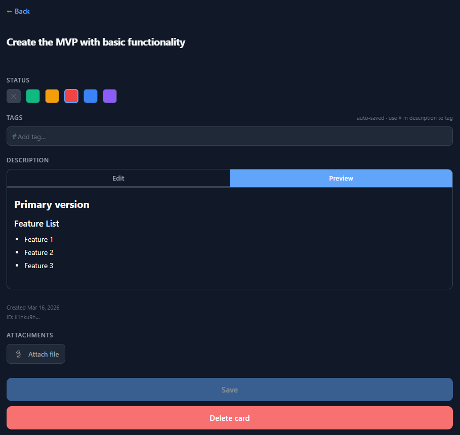

<p align="center">
  
</p>

# Super Kanban Pro

An offline-first Kanban board built with React Native and React Native Web — one codebase that runs natively on iOS, Android, and in the browser as a PWA.

All data lives on your device. No account required, no server, no subscription.


---

## Screenshots

| Projects | Board | Card |
|---|---|---|
|  |  |  |

---

## Features

- **Offline-first** — all data stored locally via WatermelonDB (SQLite on mobile, IndexedDB on web). Works without an internet connection, always.
- **Drag and drop** — long-press and drag cards between swimlane columns. Works on web (mouse) and native (touch).
- **Markdown editor** — full markdown support in card descriptions with a live preview tab and formatting toolbar. Hashtag auto-detection creates tags automatically.
- **Attachments** — attach images and files to cards. Images are compressed and thumbnailed automatically. An LRU cache eliminates flicker when scrolling.
- **Theming** — light, dark, and system-adaptive themes. Configurable font family and size.
- **PWA** — installable on desktop and mobile browsers. Offline caching via Workbox service worker. Shows an update prompt when a new version is available.
- **Local auth** — bcrypt-hashed passwords stored on device. Session persists across app restarts.

---

## Tech Stack

| Layer | Technology |
|---|---|
| Framework | React Native + React Native Web |
| Language | TypeScript (strict mode) |
| State management | Zustand |
| Database | WatermelonDB (SQLite / IndexedDB) |
| Styling | React Native StyleSheet + design tokens |
| Markdown | react-markdown + remark-gfm (web), custom inline parser (native) |
| Auth | bcryptjs |
| PWA | Workbox (InjectManifest) |
| Dev environment | Docker + Yarn workspaces monorepo |
| Testing | Jest (14 test suites, ~2400 test lines) |

---

## Monorepo Structure

```
super-kanban-pro/
├── apps/
│   ├── mobile/               React Native app (iOS + Android)
│   └── web/                  Webpack + React Native Web (browser + PWA)
├── packages/
│   ├── types/                Domain interfaces — single source of truth
│   ├── utils/                Pure utilities (UUID, fractional indexing, etc.)
│   ├── store/                Zustand slices (auth, project, UI)
│   ├── database/             WatermelonDB models, repositories, React context
│   ├── services/             Business logic (auth, cards, projects, tags, etc.)
│   ├── ui/                   Shared React Native components and screens
│   └── adapters/
│       ├── sqlite/           SQLite adapter — mobile only
│       └── indexeddb/        LokiJS/IndexedDB adapter — web only
├── Dockerfile
├── docker-compose.yml
└── jest.setup.ts
```

**Dependency flow (no cycles):**

```
apps → ui → services → database → types / utils
apps → store → types
```

Services never import from the store. The store never imports from UI. Each layer is independently testable.

---

## Getting Started

### Prerequisites

- [Docker](https://docs.docker.com/get-docker/) and Docker Compose
- That's it. Everything else (Node, Yarn, Android SDK) is inside the container.

### Run the web app

```bash
git clone https://github.com/your-username/super-kanban-pro.git
cd super-kanban-pro
docker compose up -d
```

Open **http://localhost:8080** in your browser. The first build takes ~60–90 seconds; subsequent starts are ~5 seconds.

### Run the test suite

```bash
docker compose run --rm test
```

### Open an interactive shell (for Metro, git, etc.)

```bash
docker compose exec app bash
```

### Useful commands inside the container

```bash
yarn typecheck        # TypeScript — zero errors expected
yarn lint             # ESLint
yarn test             # Jest (all 14 suites)
yarn test --watch     # Watch mode
yarn test:coverage    # Coverage report
```

---

## Project Setup (without Docker)

If you prefer running outside Docker:

**Requirements:** Node ≥ 18, Yarn ≥ 1.22

```bash
yarn install
yarn web        # starts webpack dev server at localhost:8080
yarn test       # runs the test suite
```

For mobile:

```bash
# Android
yarn workspace @kanban/mobile android

# iOS (macOS only)
cd apps/mobile/ios && pod install
cd .. && yarn ios
```

---

## Architecture

### Database

WatermelonDB provides a unified query API backed by SQLite on native and a LokiJS/IndexedDB adapter on web. The schema defines 8 tables:

`users` · `user_config` · `projects` · `swimlanes` · `cards` · `tags` · `card_tags` · `attachments`

Repositories (in `packages/database/src/repositories/`) encapsulate all database access. Services call repositories — they never touch WatermelonDB directly.

### Card ordering — fractional indexing

Cards are ordered within a lane using fractional string indices (`"1"`, `"1.5"`, `"1.75"`, …). Inserting between two cards computes the midpoint of their indices as a single write, without rewriting the whole lane. When precision drifts after thousands of moves, `rebalanceLane()` resets all indices to sequential integers.

### Drag and drop

On **web**: `onMouseDown` on a `<div>` wrapper captures the mouse, bypassing React Native Web's `Pressable` entirely. Document-level `mousemove`/`mouseup` listeners track the drag. After 300ms of holding, the drag ghost appears and lane bounds (registered via `measureInWindow`) resolve the target lane.

On **native**: `PanResponder` drives the same logic.

`DragContext` stores drag state in both React state (for re-renders) and a ref (`stateRef`) — the ref prevents stale closure bugs when `endDrag` reads `targetLaneId` and `dropIndex` at mouse-up time.

### Thumbnail caching

`ThumbnailCache` is an LRU cache backed by a doubly-linked list and a `Map`. All operations (get, set, evict) are O(1). The cache stores base64 data URIs so board thumbnails render synchronously from the cache — no flicker when scrolling back through previously-seen cards.

### PWA

The Workbox `InjectManifest` plugin builds a service worker with three caching strategies:

- **StaleWhileRevalidate** — JS/CSS bundles
- **CacheFirst** (1-year expiry) — fonts and images
- **NetworkFirst** — future sync API calls

The app shell is fully precached on install, so the app loads from cache when offline.

---

## Configuration

No `.env` file is needed for local development. Future cloud sync (Phase 13) will use:

```env
KANBAN_SYNC_ENDPOINT=https://your-sync-server.com
```

The sync endpoint can also be set per-user inside the app's Settings screen.

---

## Production Build

```bash
# Inside the container or with Node installed locally
yarn workspace @kanban/web build
```

Output lands in `apps/web/dist/`. Deploy the `dist/` folder to any static host. HTTPS is required for PWA installation and service workers (localhost is the only exception).

**Tested hosts:** Cloudflare Pages, Vercel, Netlify, Nginx.

---

## Testing

All tests run in Node via Jest — no browser or native runtime required.

```
packages/utils/src/__tests__/utils.test.ts           fractional indexing, string utils
packages/store/src/__tests__/store.test.ts            Zustand slice logic
packages/database/src/__tests__/repositories.test.ts  WatermelonDB repositories (in-memory LokiJS)
packages/services/src/__tests__/AuthService.test.ts   bcrypt, login, session
packages/services/src/__tests__/ProjectService.test.ts CRUD, ownership checks
packages/services/src/__tests__/CardService.test.ts    card CRUD, validation
packages/services/src/__tests__/MarkdownToolbar.test.ts formatting transforms
packages/services/src/__tests__/ImageProcessor.test.ts  MIME type helpers
packages/services/src/__tests__/SettingsService.test.ts config validation
packages/services/src/__tests__/ThumbnailCache.test.ts  LRU eviction (22 cases)
packages/services/src/__tests__/flatListConfig.test.ts  preset selection
packages/services/src/__tests__/rebalancer.test.ts      precision drift
packages/services/src/__tests__/useDragDrop.test.ts     neighbor resolution
packages/services/src/__tests__/pwa.test.ts             SW registration logic
```

---

## Roadmap

The codebase was designed from the start to support these next steps without major refactoring:

**Phase 13 — Cloud sync**
WatermelonDB has a built-in `synchronize()` pull-then-push protocol. The schema already has `deleted_at` soft-delete columns and `updated_at` timestamps. The Settings screen already has the sync toggle and endpoint field — they just need to be un-disabled.

**Phase 14 — Multi-device / collaboration**
Once sync is enabled, multiple devices can share boards. Conflict resolution defaults to last-write-wins, which is correct for Kanban cards.

**Card templates**
A "template" is a card with `isTemplate: true` added to the schema. The `createCard` service method can accept a `fromTemplate` option.

**Rich text**
The description is stored as Markdown. A future editor (e.g. TipTap) can import/export Markdown, making it backward-compatible.

**End-to-end encryption**
All data lives in WatermelonDB. Encrypting the SQLite file on mobile uses `react-native-mmkv` for the key. On web, blobs can be encrypted before writing to IndexedDB.

---

## Contributing

Pull requests are welcome. For significant changes, please open an issue first to discuss what you'd like to change.

```bash
# Create a feature branch
git checkout -b feat/your-feature

# Make changes, then run checks
yarn typecheck && yarn lint && yarn test

# Commit and push
git add .
git commit -m "feat: describe your change"
git push origin feat/your-feature
```

---

## License

MIT — see [LICENSE](LICENSE) for details.